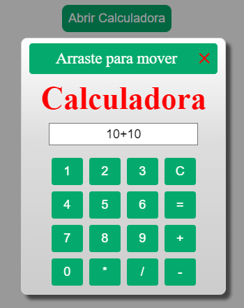

# Simple-Draggable-Calculator
 **A simple draggable calculator made using HTML - CSS - JS**

Currently this project is in beta phase in its version 1.0,
This is a lab project aimed at honing my skills, so there may be no updates

Developed by Cristian Vieira with knowledge acquired in [W3schools](https://www.w3schools.com/)

view the project image:

  

---
## Calculadora simples arrastavel

Descrição em PT-BR:

**Uma calculadora simples e arrastável feita usando HTML - CSS - JS**

Atualmente este projeto está em fase beta em sua versão 1.0,
Este é um projeto de laboratório destinado a aprimorar minhas habilidades, portanto, pode não haver atualizações

Desenvolvido por Cristian Vieira com conhecimentos adquiridos em [W3schools](https://www.w3schools.com/)
